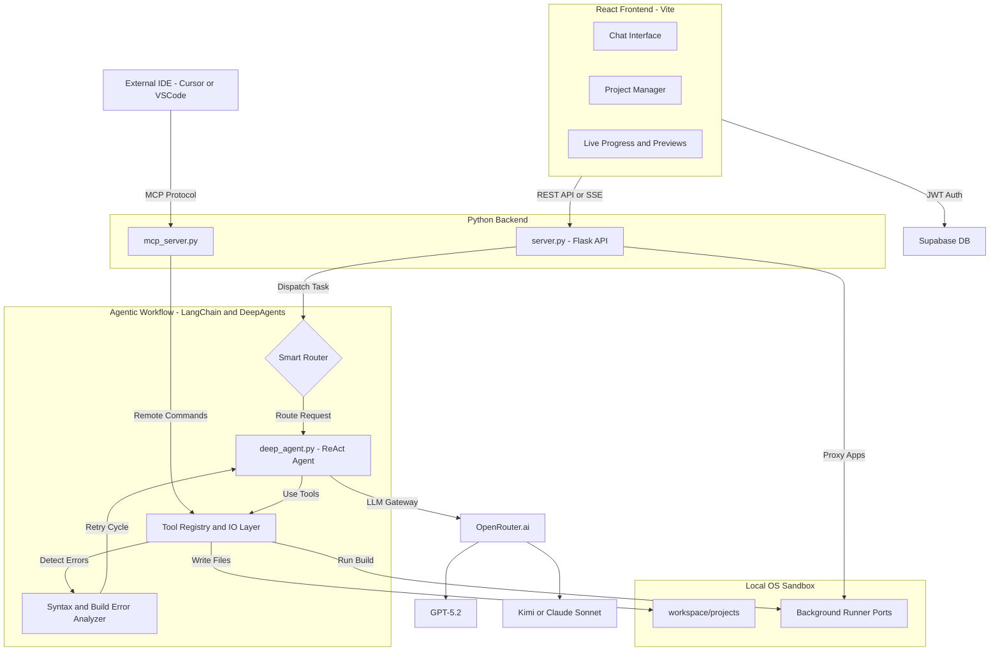

# 🤖 DevAgent: Autonomous Agentic AI Software Engineer

Welcome to the comprehensive documentation for **DevAgent** - an advanced, multi-agent framework designed to autonomously build, test, and deploy full-stack web applications. By deeply integrating LangChain, OpenRouter (multi-LLM routing), Model Context Protocol (MCP), and a live containerized or local workspace, DevAgent acts as a Senior Software Engineer right on your machine.

---

## 📑 Table of Contents

1. [Architectural Overview](#architectural-overview)
2. [How it Works as an Agentic AI](#how-it-works-as-an-agentic-ai)
3. [Step-by-Step Agentic Workflow](#step-by-step-agentic-workflow)
4. [The Model Context Protocol (MCP) Server](#the-model-context-protocol-mcp-server)
5. [In-Depth Module Documentation](#in-depth-module-documentation)
    - [1. `agents/deep_agent.py` - Core Intelligence](#1-agentsdeep_agentpy---core-intelligence)
    - [2. `agents/runner_agent.py` - Execution Engine](#2-agentsrunner_agentpy---execution-engine)
    - [3. `server.py` - Flask Streaming Backend](#3-serverpy---flask-streaming-backend)
    - [4. `db.py` - Memory & Supabase Layer](#4-dbpy---memory--supabase-layer)
    - [5. `main.py` - CLI Interface](#5-mainpy---cli-interface)
    - [6. `mcp_server.py` & `mcp_wrapper.py`](#6-mcp_serverpy--mcp_wrapperpy)
6. [AI & Orchestration Layer](#ai--orchestration-layer)
7. [Supported Tech Stacks](#supported-tech-stacks)
8. [Detailed Tool Definitions](#detailed-tool-definitions)
9. [Setup & Installation](#setup--installation)
10. [Docker Deployment](#docker-deployment)
11. [Future Extensibility](#future-extensibility)

---

## 1. 🏗️ Architectural Overview

DevAgent is a full-stack system comprising a modern **React (Vite) Frontend**, a **Flask REST/SSE Backend**, a remote **Supabase Postgres Database**, and an internal **LangChain-powered Agent Framework**. 

The system leverages several LLMs dynamically via **OpenRouter**:
- **GPT-5.2 / Planning Models** for scaffolding and architecture.
- **Kimi / Claude Sonnet** for deep code generation and long-context logic rewriting.
- **Gemini 3 Flash** for quick file lookups, summaries, and verifications.
- **MiniMax** for specialized documentation.

**Key Features:**
- **Persistent Memory:** It remembers earlier projects and uses Supabase to track code history, chat logs, and API settings.
- **Sandboxed Execution:** Agents create physical folders mapped correctly on your disk (or Docker volume), run npm/pip installs securely, and boot background servers using subprocesses.
- **Self-Healing:** Built-in semantic log analysis. If a Vite build fails, the agent intercepts the `stderr`, strips out noise, isolates the syntax/dependency error, opens the specific file, fixes it, and re-runs the build autonomously.

### Core System Architecture



---

## 2. 🧠 How it Works as an Agentic AI

Unlike a standard LLM chatbot that only outputs code blocks for you to copy-paste, DevAgent embodies **Agency**:

1. **Perception:** DevAgent reads the environment using tools (`read_project_file`, `list_project_files`).
2. **Decision/Planning:** Based on a prompt ("Build me a FastAPI React app"), it breaks the task into logical segments (1. Init Frontend, 2. Init Backend, 3. Stitch them). 
3. **Action (Actuation):** The agent executes tools iteratively. It writes `package.json`, then `app.py`, then runs `run_shell_command("npm install")`.
4. **Observation/Feedback Loop:** The framework parses the outputs of the actions. If `npm install` reports peer dependency conflicts, the agent observes this state, updates its plan, and runs `npm install --legacy-peer-deps`.
5. **Autonomy:** It does not stop returning to the human until *all tests pass* and the application successfully binds to a localhost port.

### The Brain (`deep_agent.py`)
This is a LangChain ReAct agent initialized with `create_deep_agent`. It passes a defined list of Python functions (tools) into the LLM context. 

---

## 3. 🔄 Step-by-Step Agentic Workflow

When a user requests a new project (e.g., "Create a Todo List in React"), the following highly orchestrated pipeline triggers:

### Phase 1: Context & Intent Recognition
1. **Request Intake:** The frontend POSTs the task to `/api/run` in `server.py`.
2. **Smart Routing:** The `smart_route()` function kicks in. It checks keyword heuristics (e.g., "react" -> defaults to Kimi or Claude optimized for frontend code).
3. **Memory Retrieval:** `db.py` queries Supabase. Does the user already have projects? Does the target codebase already exist? Context is injected into the LLM System Prompt.

### Phase 2: Generation & File Writing
4. **Tool: `create_project("todo-app", "react")`**: The agent executes this tool, which creates a directory structure dynamically.
5. **Tool: `write_project_file` (Iterative Loop)**:
   - Agent writes `package.json`.
   - Agent writes `vite.config.js` (ensuring base paths are correct).
   - Agent writes `index.html`.
   - Agent iteratively writes all required `src/` files (e.g., `App.jsx`, `main.jsx`, CSS).
6. **Streaming State:** While this loop operates, `server.py` pushes real-time Server-Sent Events (SSE) to the frontend, updating the user UI visually (Live Progress).

### Phase 3: Build & Execution
7. **Tool: `install_dependencies`**: The agent notices Python vs. Node files and triggers pip/npm respectively.
8. **Subprocess Observation:** The agent waits up to 180 seconds, reading the stdout/stderr.
9. **Build Error Analyzer:** If an error occurs, `analyze_build_error()` kicks in. It parses Vite/NextJS/Webpack trace logs, extracting standard `err_report` formats.
10. **Auto-Fix Loop:** If a build fails, DevAgent issues a `fix_error_in_project` command automatically, reloading the context of the broken file, writing the fix, and retrying up to 3 times automatically.

### Phase 4: Finalize
11. **Tool: `run_project`**: The agent executes the app. It hunts for available ports (3000+, 5000+), binds the process, and returns the live preview URL to the user UI.
12. **Database Sync:** The database performs a recursive map of `workspace/todo-app`, registering all active file paths, sizes, and timestamps to Supabase memory.

---

## 4. 🔌 The Model Context Protocol (MCP) Server

**What is MCP?**
The Model Context Protocol (MCP) standardizes how AI models securely interact with external data sources and tools. By wrapping DevAgent's capabilities in MCP, *any* external IDE (like Cursor, VSCode with Copilot) or other AI agents can remotely utilize DevAgent's building expertise.

### How it is implemented
1. **`mcp_server.py`**: A standard Flask interface running independently on port `8889`. It traverses the `CUSTOM_TOOLS` array from `deep_agent.py`, converting their internal Python Pydantic models/schemas into the universal MCP `input_schema` JSON representation format.
2. **Endpoint `/mcp/tools`**: Exposes the schema.
3. **Endpoint `/mcp/execute`**: Accepts an incoming MCP tool execution request. It identifies the target, unmarshals the arguments (e.g., executing a sandbox Python evaluation securely), and returns the executed JSON back to the caller IDE.
4. **`mcp_wrapper.py`**: Interacts with the `FastMCP` standard package, serving as an advanced proxy pipeline that binds the Flask tools securely to the host system OS. 

*Why this matters:* DevAgent is not trapped in its own web UI. You can point independent autonomous pipelines directly at the `/mcp/execute` endpoints to have DevAgent scaffold sub-systems for larger enterprise builds.

---

## 5. 🔬 In-Depth Module Documentation

### 1. `agents/deep_agent.py` - Core Intelligence

At over 1,164 lines, this is the powerhouse of the application.

#### Major Components:
- **`analyze_build_error(raw_logs, project_type)`**: 
  - Regex-heavy function identifying 7 universal failure modes: Module missing, Line specific syntax errors, NPM ERESOLVE/peer-dep conflicts, Missing package.json scripts, TypeScript TS2xxx errors, Vite specific crashes, and File permission EACCES blocks.
- **`build_and_get_entry(project_name, user_id)`**:
  - Auto-detects the tech stack recursively.
  - If **Vite**, auto-injects `base: './'` so relative routing works when served through isolated proxy ports.
  - If **NextJS**, auto-injects `output: 'export'` ensuring SSG static generation is forced for previewability.
  - Checks ports recursively, binds background processes, and returns status.
- **Custom Tools Definitions**:
  - Functions specifically decorated with `@tool` for Langchain. Documented exclusively in section [Detailed Tool Definitions](#detailed-tool-definitions).
- **`build_system_prompt()`**:
  - Dynamically synthesizes environment variables (OS Type pathings, current workspace absolute paths, known user projects from Supabase) and injects them into the initial LLM instruction chunk.
- **`run_agent(task, model_key, project_name)`**:
  - Instantiates the specific OpenRouter LLM. Sets up `LiveProgressCallback`. Implements the overarching `max_retries` auto-fix loop logic around LangChain's invocation chain.

### 2. `agents/runner_agent.py` - Execution Engine

Standalone script for determining the execution schema of an unknown folder.
- Scans memory contents. If it spots an `index.html` without packages, uses Python's `http.server`.
- If it sees `app.py`, uses regex to check if it's `FastAPI` (uses uvicorn `--reload`) or standard `Flask`.
- If it spots `package.json`, checks the "scripts" object for a "start" command to fallback dynamically.

### 3. `server.py` - Flask Streaming Backend

Flask server mapping the frontend to the DeepAgent instance.
- **`@auth_required` decorator**: Validates JWTs strictly against the Supabase `auth.get_user(token)` endpoints. Ensures User A cannot execute shell commands inside User B's folder workspace.
- **Streaming Pipeline (`/api/run` vs `/api/stream/<id>`)**:
  - Spawns threading locally to prevent blocking the WSGI worker.
  - Implements the `StreamingCallback(BaseCallbackHandler)` which translates complex Langchain `on_tool_start`, `on_llm_start`, `on_tool_end` invocations into clean, minified dictionaries passed via python `queue.Queue`.
- **MIME & Proxy Route (`/api/workspace/<uid>/...`)**:
  - Proxies dynamically built files safely. Handles MIME types manually to ensure JS and CSS render appropriately dynamically after builds out of `.vite` or `dist/` folders.

### 4. `db.py` - Memory & Supabase Layer

Handles all interactions with Postgres via `supabase-py`.
- Maintains the `profiles` table logic.
- Integrates `ensure_profile` tracking session contexts locally using `ContextVar` inside Async/Thread-safe bounds.
- Provides `get_similar_errors` hooks for future RAG (Retrieval Augmented Generation) logic so DevAgent learns from past mistakes.

### 5. `main.py` - CLI Interface

A highly featured terminal overlay to the agent framework. For developers preferring terminals over web GUIs.
- Captures double-linebreaks for easy code block pasting.
- Directly invokes `run_agent` directly outputting to standard CLI output streams.

### 6. `mcp_server.py` & `mcp_wrapper.py`
Defined under [The MCP Server section](#the-model-context-protocol-mcp-server).

---

## 6. 🔗 AI & Orchestration Layer

Understanding the internal AI tech stack is crucial for extending DevAgent. Here is how the core orchestration frameworks interact to create true Agency:

### LangChain & DeepAgents
- **LangChain Core:** Serves as the fundamental orchestration layer. It provides the abstractions for Prompt Templates, LLM unified interfaces (`ChatOpenAI`), and the `@tool` bindings that map python functions to LLM schemas.
- **DeepAgents (`deepagents==0.4.11`):** A specialized wrapper framework (imported via `from deepagents import create_deep_agent`). It streamlines LangChain's complex abstractions, drastically simplifying the initialization of ReAct/Function-calling loops via local shell backends. It automatically manages passing physical filesystem boundaries directly into the LLM context.

### LangGraph (State Loops)
Under the hood of modern Agentic execution wrappers lies a cyclic execution graph (resembling LangGraph architecture). Instead of a linear script (User -> LLM -> Response), DevAgent operates in an autonomous loop:
1. LLM issues a command (e.g., `write_project_file`).
2. Environment (Python tool interpreter) executes the command.
3. Result returns to the LLM agent as Observation data.
4. Loop continues until the LLM verifies the structure is complete. 
This is what allows DevAgent's **"Self-Healing"** behavior. When Vite fails, the graph feeds the `stderr` string back to the LLM agent without human intervention, allowing it to autonomously issue fixing `.replace()` commands or install missing packages.

### OpenRouter
OpenRouter (`models.py`) acts as the unified model gateway. 
- Instead of maintaining 5 distinct API integrations (OpenAI, Anthropic, Google, Moonshot, MiniMax) with varying schema libraries, OpenRouter provides a single standard OpenAI-compatible REST endpoint.
- The `smart_route()` algorithm routes specific architectural intents (e.g. "plan") to `openai/gpt-5.2` for logical structure definition, while "react" / "code writing" vectors route to `moonshotai/kimi-k2.5` or `anthropic/claude-sonnet-4-6`. By structurally separating concerns via OpenRouter strings, API cost is minimized while specific language generation quality is maximized.

### Model Context Protocol (MCP)
MCP resolves the limitation of DevAgent being trapped in its own React/Flask UI. 
- **`mcp_server.py` & `mcp_wrapper.py`:** Packages the native internal `CUSTOM_TOOLS` list into a standardized SSE API exposing an `input_schema`.
- **The True Advantage:** You can plug DevAgent directly into MCP-compatible IDEs like **Cursor**, **Windsurf**, or **Claude Desktop**. The IDE senses the MCP endpoints and delegates file manipulations directly to DevAgent running silently in the background. It turns DevAgent into an OS-level AI service rather than just a web app.

---

## 7. 🌐 Supported Tech Stacks

DevAgent natively understands how to scaffold, debug, and bootstrap the following structural setups:

| Stack | File Triggers & Identifiers | Auto-Build Behavior |
|-------|-----------------------------|----------------------|
| **React (Vite)** | `vite.config.js`, `package.json` | Runs `npm install`, injects `./` base paths, runs `npm run build`, serves from `/dist` |
| **Next.js** | `next.config.js`, `next.config.mjs` | Injects `output: export`, runs build, serves from `/out` |
| **Python Flask** | `app.py` containing `Flask` | Installs `requirements.txt`, binds env port, serves daemonially. |
| **FastAPI** | `app.py` containing `fastapi` | Runs via Uvicorn, opens `/docs` natively. |
| **Node Backend**| `index.js`, express | Spots standard package signatures and boots via node. |
| **Static HTML** | `index.html` root | Pure server parsing without build steps. |

---

## 8. 🛠️ Detailed Tool Definitions

The LLM is given strict, constrained access via these custom LangChain tools. **Zero arbitrary system execution is allowed.**

1. **`create_project(project_name: str, stack: str, desc: str) -> str`**
   - **Role:** Generates an identity directory inside `workspace/{user_id}/`. Connects project status to DB as "initializing".
   
2. **`write_project_file(project_name: str, filename: str, content: str) -> str`**
   - **Role:** Central IO layer. Forces absolute paths. Prevents directory traversal attacks via strict pathing resolution inside the workspace. The LLM must pass raw strings explicitly.

3. **`read_project_file(project_name: str, filename: str) -> str`**
   - **Role:** Retrieves memory inside specific bounded files.

4. **`list_project_files(project_name: str) -> str`**
   - **Role:** Crucial "Perception" tool. Gives the LLM tree-like mappings and file byte boundaries to understand project shapes.

5. **`run_shell_command(command: str, project_name: str) -> str`**
   - **Role:** Masked `subprocess.run()`. Timeout limited to 120 seconds. Restricted to execution CWD of the exact project folder explicitly to prevent polluting the server disk.

6. **`install_dependencies(project_name: str) -> str`**
   - **Role:** High abstraction wrapper. The LLM does not need to guess between pip/npm or deal with complex lockfile architectures. It fires this, and the python backend resolves package systems natively.

7. **`fix_error_in_project(project_name: str, error_message: str) -> str`**
   - **Role:** Meta-tool. Captures all text across all files less than 2000 chars natively, aggregates them into a massive chunk, and asks the LLM to process it to find the root flaw (e.g. cross imports or circular loops).

8. **`generate_image_with_fal(prompt: dict|str) -> str`**
   - **Role:** Generates UI assets dynamically using Fal AI (specifically `fal-ai/flux/schnell`). Allows the AI to generate stock placeholders instead of grey boxes, yielding aesthetic immediate previews.

9. **`python_sandbox(code: str) -> str`**
   - **Role:** Used if the Agent is asked to do highly complex logical deductions, data processing, or algorithmic validation before writing the final code. Acts exactly like ChatGPT's Advanced Data Analysis boundary.

---

## 9. 🚀 Setup & Installation

### Prerequisites
- Python 3.10+
- Node.js v18+
- Supabase Account / Postgres DB
- OpenRouter API Key (or individual OpenAI/Anthropic keys)

### Step 1: Environment Variables
Create a `.env` in the root:
```env
OPENAI_BASE_URL=https://openrouter.ai/api/v1
# Optional: Set directly instead of passing via UI settings
OPENROUTER_API_KEY=sk-or-v1-xxxx
VITE_APIBASE=http://localhost:8888
VITE_SUPABASE_URL=https://your-project.supabase.co
VITE_SUPABASE_ANON_KEY=eyJhbGciOiJIUz...
```

### Step 2: Backend Setup
```bash
python -m venv venv
# Windows: venv\Scripts\activate
# Mac/Linux: source venv/bin/activate

pip install -r requirements.txt
python server.py
```

### Step 3: Frontend Setup
```bash
cd ui
npm install
npm run dev
```

Your system interface is now running at `http://localhost:5173`. 
The Python execution server is listening at `http://localhost:8888`.

---

## 10. 🐳 Docker Deployment

For standardized environments, Docker compose is bundled mapping volumes deeply.

```yaml
# To deploy:
docker-compose up --build -d
```

The Dockerfile is structured as a two-tier microservice architecture:
- `backend.Dockerfile`: Built on `python:3.10-slim`. Binds volume mounts rigidly to `/app/workspace` preventing the containerized agent from altering system variables. Installs system Node.js bounds so the python agent can still run `npm` effectively inside Docker.
- `frontend.Dockerfile`: Generates React static assets cleanly.

---

## 11. 🔮 Future Extensibility

DevAgent is built on a modular plugin framework conceptually. Next steps for core development:
- **VSCode Plugin:** Directly hooking natively through `mcp_server.py` replacing the `ui/`.
- **RAG for Project Memory:** Adding vector DB abstractions utilizing `ChromaDB` so when dealing with a 50+ file project, the agent isn't blowing out context limits and is intelligently fetching relevant files.
- **Automated Deployment:** Adding an Azure/Vercel/Render integration tool where the LLM automatically deploys the successfully built local workspaces onto public domains. 

---
*Developed with Advanced Agentic principles. Let AI build your pipelines, flawlessly.*
